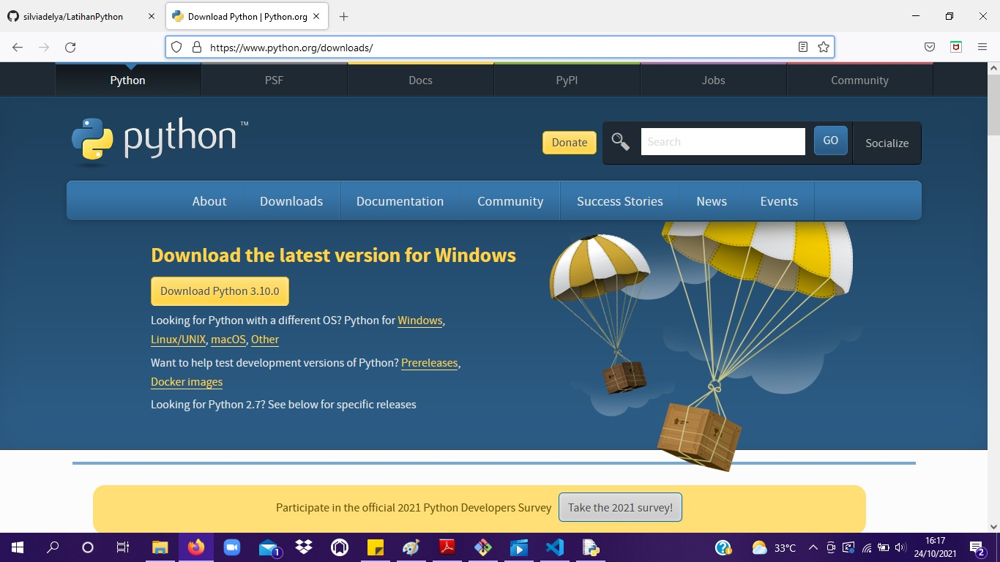
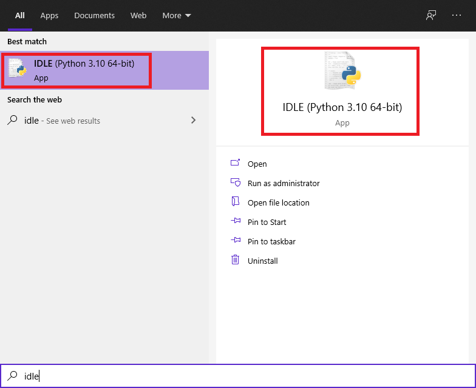
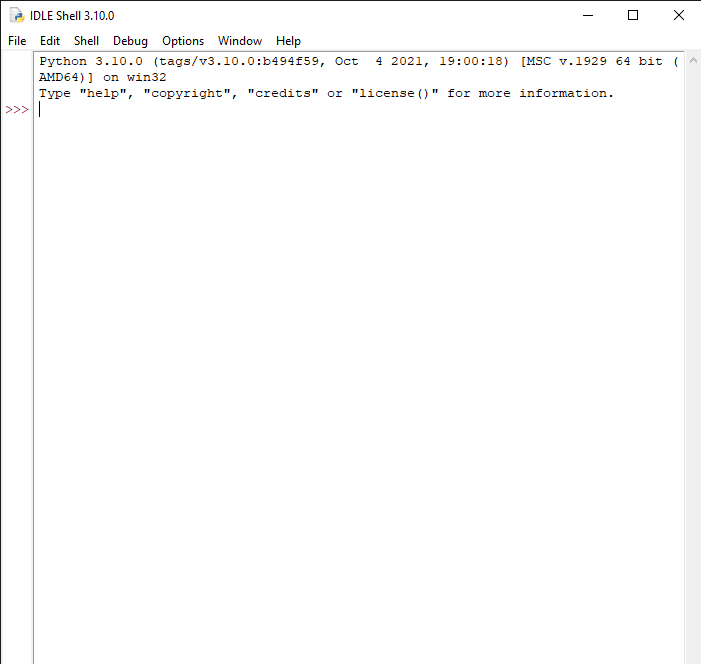
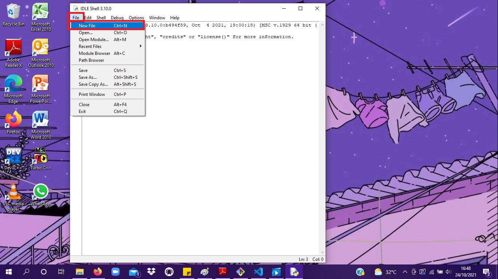
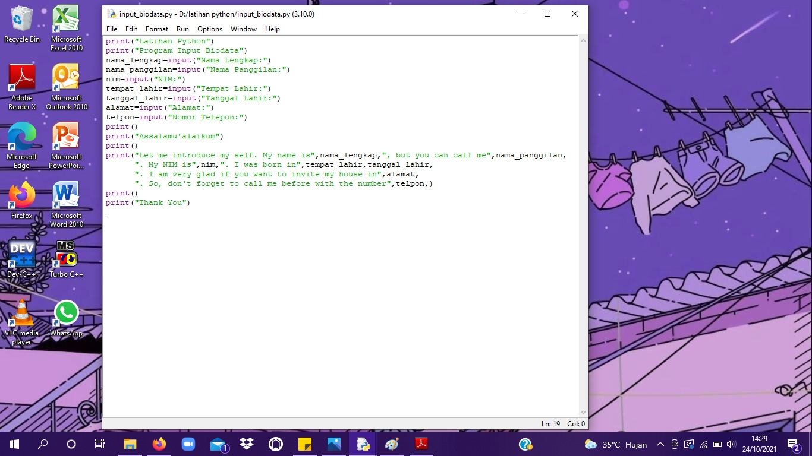
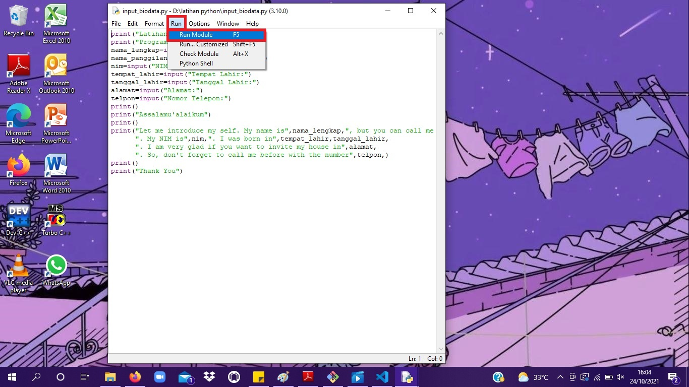
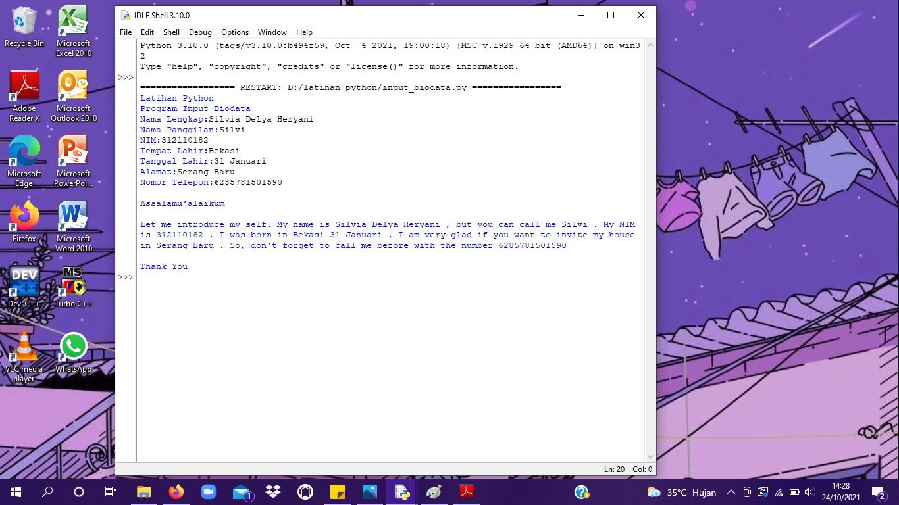

# Tutorial Perintah Dasar Python

1. Sebelum menggunakan Python, download terlebih dahulu di <a href="https://www.python.org/downloads/">Python</a>

2. Sesuaikan arsitektur komputer anda, kemudian download lalu install. Untuk tutorial penginstallan bisa dilihat di <a href="https://belajarpython.com/tutorial/instalasi-python">Install Python</a>

3. Jika sudah terinstall, jalankan program Python. Tekan shortkey logo windows, ketik <b>"IDLE"</b> di search bar. Lalu klik <b>"IDLE"</b>

4. Tampilannya akan seperti di bawah ini.

5. Klik <b>"File"</b>, lalu <b>"New File"</b> untuk membuat file baru.

6. Lalu buatlah sebuah program sederhana di Python, contohnya seperti program yang saya buat di bawah ini.

7. Jika sudah selesai Klik <b>Save As</b>, lalu beri nama file tersebut dengan format <b>.py</b> karena file tersebut ditulis dengan menggunakan program python. Kemudian arahkan file program yang telah dibuat tadi ke dalam suatu folder, lalu klik <b>Save</b>

![img] screenshot/idle-py.jpg

8. Kemudian klik <b>Run</b>, lalu <b>Run Module</b>

9. Jika sudah di "Run", maka akan seperti di bawah ini.

<h3>Penjelasan</h3>

Dalam contoh program yang saya tampilkan di atas, ada beberapa perintah dasar Python yaitu;<b>Input</b> dan <b>Print</b>. Fungsi <b>print()</b> berfungsi untuk mencetak atau menampilkan objek ke perangkat keluaran (layar) atau ke file teks. 

Contoh : 
<b>print("Latihan Python")</b>

Maka jika di jalankan (Run) akan muncul teks,

<b>Latihan Python</b>

Sedangkan fungsi <b>input()</b> berfungsi untuk menerima baris input dari user dan mengembalikannya dalam bentuk string.

Contoh :

<b>nama_lengkap=input("Nama Lengkap:")</b>

Maka jika di jalankan (Run) akan muncul teks seperti di bawah ini, yang mana teks tersebut harus di input oleh user untuk dikembalikan lagi dalam bentuk string.

<b>Nama Lengkap:</b>
